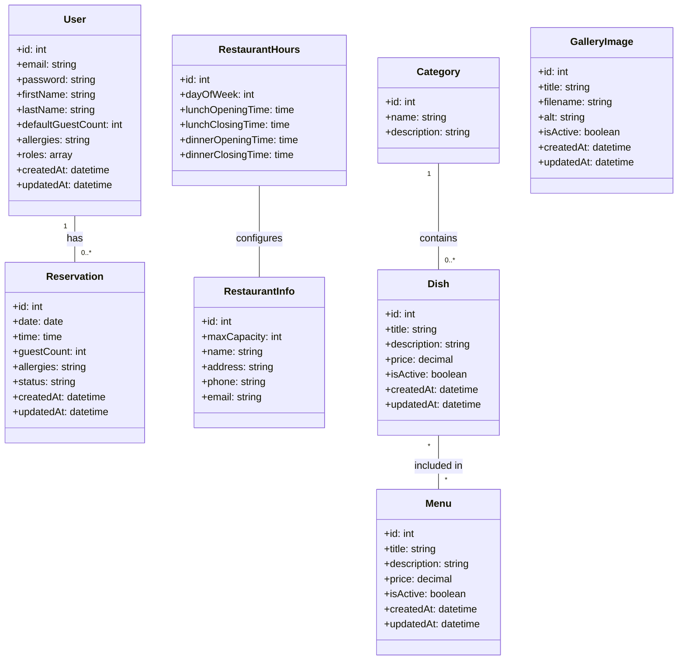
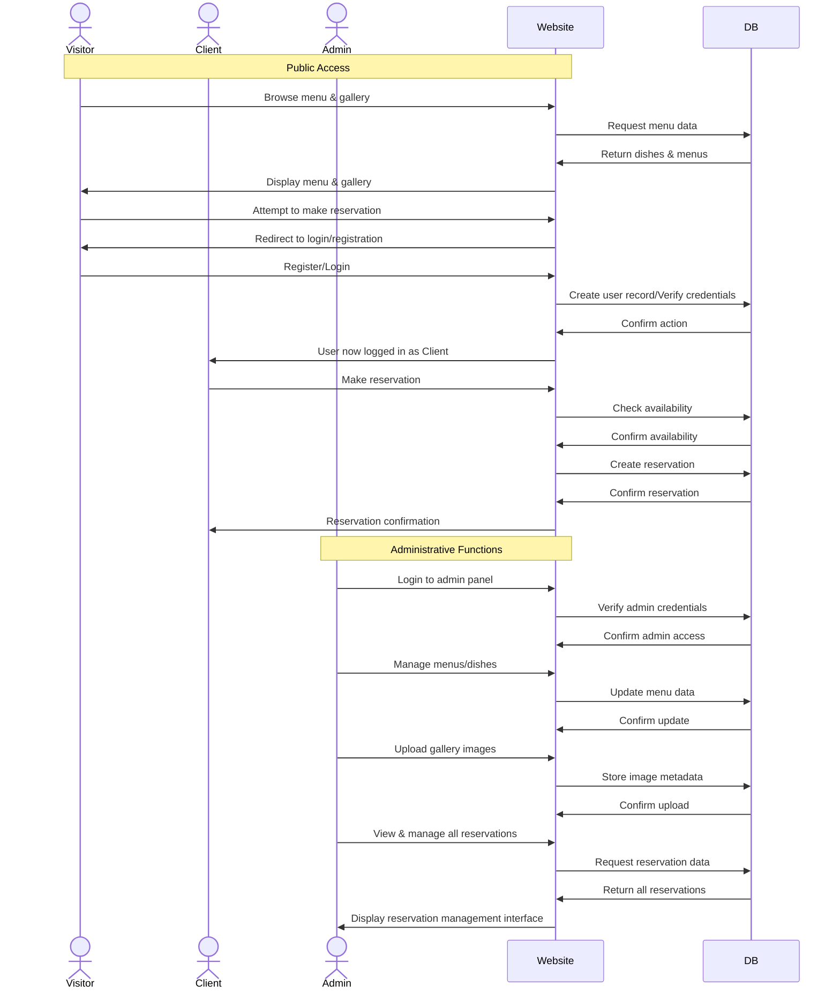

# Quai Antique - Apache Setup Guide

This document outlines the process for setting up an Apache server with PHP for the Quai Antique project on Ubuntu.

## Prerequisites

- Ubuntu operating system
- sudo privileges
- Basic terminal knowledge

## Installation

### Step 1: Install Apache and PHP

```bash
sudo apt update
sudo apt install apache2 php libapache2-mod-php php-mysql
```

### Step 2: Configure Apache Virtual Host

Create a configuration file for your site:

```bash
sudo nano /etc/apache2/sites-available/quai-antique.conf
```

Add the following content:

```apache
<VirtualHost *:80>
    ServerAdmin webmaster@localhost
    ServerName quai-antique.local
    ServerAlias 127.0.0.1
    DocumentRoot /home/dlesieur/Documents/Studi/Quai-Antique/quai_antique

    <Directory /home/dlesieur/Documents/Studi/Quai-Antique/quai_antique>
        Options Indexes FollowSymLinks
        AllowOverride All
        Require all granted
    </Directory>

    ErrorLog ${APACHE_LOG_DIR}/quai-antique-error.log
    CustomLog ${APACHE_LOG_DIR}/quai-antique-access.log combined
</VirtualHost>
```

### Step 3: Configure Directory Module

Edit the directory module configuration to prioritize PHP files:

```bash
sudo nano /etc/apache2/mods-enabled/dir.conf
```

Modify the DirectoryIndex line to:

```apache
<IfModule mod_dir.c>
    DirectoryIndex index.php index.html index.cgi index.pl index.xhtml index.htm
</IfModule>
```

### Step 4: Enable the Site and Modules

```bash
sudo a2ensite quai-antique.conf
sudo a2dissite 000-default.conf
sudo a2enmod rewrite
sudo systemctl reload apache2
```

### Step 5: Update Hosts File

```bash
sudo nano /etc/hosts
```

Add the following line:

```
127.0.0.1   quai-antique.local
```

### Step 6: Set Directory Permissions

```bash
sudo chown -R www-data:www-data /home/dlesieur/Documents/Studi/Quai-Antique/quai_antique
sudo chmod -R 755 /home/dlesieur/Documents/Studi/Quai-Antique/quai_antique
```

## Symfony Configuration

After setting up Apache and PHP, you need to configure Symfony-specific requirements:

### Step 1: Fix Directory Permissions

Make var/cache and var/log directories writable for the web server:

```bash
# Make sure you're in the project directory
cd /home/dlesieur/Documents/Studi/Quai-Antique/quai_antique

# Change ownership to your user (replace 'dlesieur' with your username)
sudo chown -R dlesieur:www-data var/
sudo chmod -R 775 var/

# If the above doesn't work, try:
sudo chmod -R 777 var/cache/ var/log/
```

For a more permanent solution using ACL (recommended):

```bash
# Install ACL if not already installed
sudo apt-get install acl

# Set proper permissions
sudo setfacl -R -m u:www-data:rwX -m u:`whoami`:rwX var
sudo setfacl -dR -m u:www-data:rwX -m u:`whoami`:rwX var
```

### Step 2: Fix PDO MySQL Driver Issues

If you see errors about loading PDO MySQL driver, try these steps:

```bash
# Reinstall PHP MySQL extensions with dependencies
sudo apt remove php-mysql
sudo apt autoremove
sudo apt install php-mysql php-common php-cli php-fpm
sudo phpenmod pdo_mysql

# For mysqlnd issues, also install:
sudo apt install php-mysqlnd

# Restart Apache
sudo systemctl restart apache2

# Check if MySQL extension is properly installed
php -m | grep mysql
```

### Step 3: Install PDO Drivers (required for Doctrine)

```bash
sudo apt install php-mysql
# Restart Apache to apply changes
sudo systemctl restart apache2
```

### Step 4: Check Symfony Requirements

Verify all requirements are met:

```bash
php bin/console about
```

### Step 5: Clear Cache After Configuration Changes

```bash
php bin/console cache:clear
```

## Additional Symfony Tips

- Update project dependencies: `composer update`
- Create database: `php bin/console doctrine:database:create`
- Run migrations: `php bin/console doctrine:migrations:migrate`
- Check security vulnerabilities: `composer require symfony/security-checker --dev`

## Testing the Installation

Create a test file to verify PHP is working:

```bash
nano /home/dlesieur/Documents/Studi/Quai-Antique/quai_antique/index.php
```

Add this content:

```php
<?php
phpinfo();
?>
```

Access the site at http://quai-antique.local or http://127.0.0.1

## Troubleshooting

### Common Issues:

1. **404 Not Found Error**:
   - Check that your virtual host configuration is enabled
   - Verify that the DocumentRoot path exists
   - Check Apache error logs: `sudo tail -f /var/log/apache2/error.log`

2. **Permission Denied**:
   - Check directory permissions
   - Verify that www-data can access your project directory

3. **PHP Code Showing Instead of Executing**:
   - Make sure PHP module is enabled: `sudo a2enmod php`
   - Check PHP installation: `php -v`

4. **Apache Won't Start**:
   - Check configuration syntax: `sudo apache2ctl configtest`
   - Look for errors: `systemctl status apache2`

5. **PDO MySQL Loading Issues**:
   - If you see "undefined symbol: mysqlnd_get_client_info" error:
     ```bash
     sudo apt install php-mysql php-mysqlnd
     sudo phpenmod pdo_mysql
     sudo systemctl restart apache2
     ```
   - Verify PHP MySQL extensions are installed: `php -m | grep mysql`
   - Check PHP version compatibility with installed extensions

6. **Cache Directory Writing Problems**:
   - Run Symfony commands as your user, not as root
   - Clear the cache directory manually: `rm -rf var/cache/*`
   - Check that your web server user (www-data) is in your group: `groups www-data`
   - Use ACL for best results with permission management

## Maintenance Commands

- Restart Apache: `sudo systemctl restart apache2`
- Check Apache status: `sudo systemctl status apache2`
- View Apache error logs: `sudo tail -f /var/log/apache2/error.log`
- View site-specific error logs: `sudo tail -f /var/log/apache2/quai-antique-error.log`

## Alternative Development Server

If you're experiencing issues with the Symfony server (PHP-FPM errors), you can use PHP's built-in web server instead:

### Using the Provided Script

We've included a script to easily start a development server:

```bash
chmod +x ./start_server.sh
./start_server.sh
```

This will start a server at http://localhost:8000. You can specify a different port if needed:

```bash
./start_server.sh 8080
```

### Manual Method

You can also start PHP's built-in server manually:

```bash
php -S 0.0.0.0:8000 -t public
```

This approach doesn't rely on PHP-FPM and avoids the PDO MySQL extension loading issues that can occur with the Symfony server.


## DIAGRAM 

```Mermaid
graph TD
    subgraph Users
        V[Visitor]
        C[Client]
        A[Administrator/Host]
    end

    subgraph "Quai Antique Web Application"
        subgraph "Public Features"
            HP[Homepage]
            M[Menu Display]
            G[Image Gallery]
            RF[Reservation Form]
            AF[Authentication Forms]
        end

        subgraph "Client Features"
            CP[Client Profile]
            RM[Reservation Management]
        end

        subgraph "Admin Features"
            HM[Restaurant Hours Management]
            MM[Menu Management]
            GM[Gallery Management]
            ARM[All Reservations Management]
            CM[Capacity Management]
        end
    end

    subgraph Database
        Users[(Users)]
        Dishes[(Dishes)]
        Categories[(Categories)]
        Menus[(Menus)]
        Hours[(Hours)]
        Gallery[(Gallery)]
        Reservations[(Reservations)]
        RestaurantInfo[(Restaurant Info)]
    end

    %% User interactions
    V --> HP
    V --> M
    V --> G
    V --> RF
    V --> AF
    
    C --> CP
    C --> RM
    C --> RF
    
    A --> HM
    A --> MM
    A --> GM
    A --> ARM
    A --> CM

    %% Database connections
    HM <--> Hours
    MM <--> Dishes
    MM <--> Categories
    MM <--> Menus
    GM <--> Gallery
    ARM <--> Reservations
    RF <--> Reservations
    CM <--> RestaurantInfo
    AF <--> Users
    CP <--> Users
    RM <--> Reservations
```





